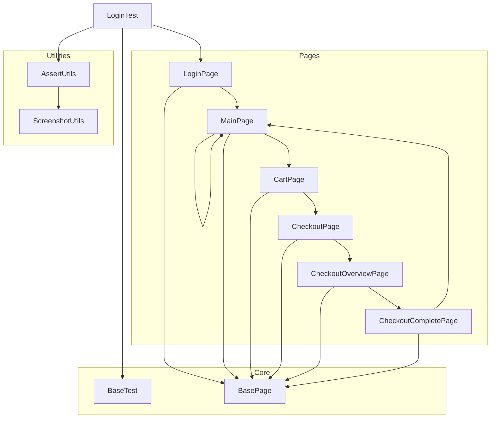
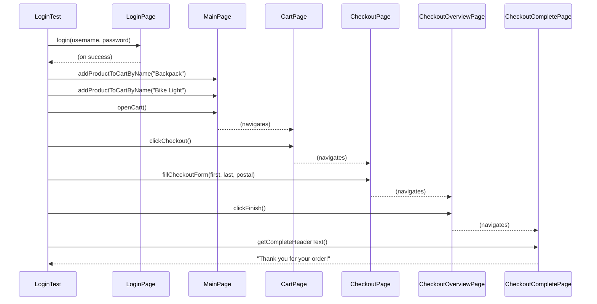

# UI Automation Test Flow (Diagram)

The following diagram illustrates the flow of a typical end-to-end test in your Selenium/Spring Boot test suite:

**Legend:**
- Boxes represent classes/roles.
- Arrows represent either navigation (test flow) or inheritance/usage relationships.
- Flow is top-down (test → pages → subsequent steps).

For a visual in your editor, paste the diagram block above into any Mermaid.js viewer or markdown editor with Mermaid support.

---

This diagram visualizes your available options for viewing Mermaid diagrams from the project.

---

## UI Test Flow – UML Sequence Diagram

